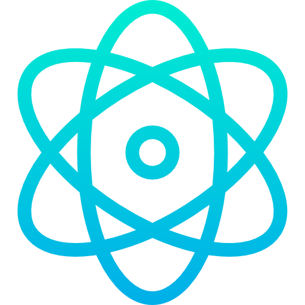
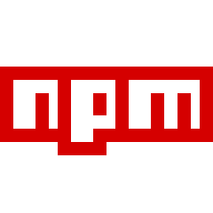
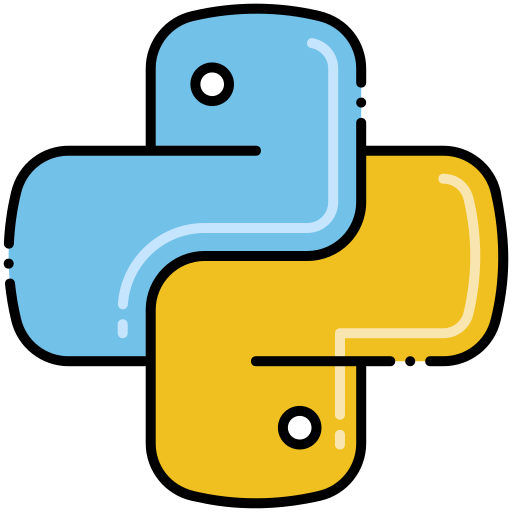
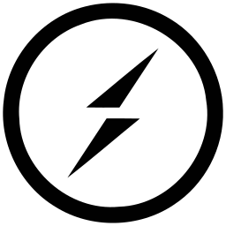

    
    
    
    
    
    

  

###### <b>I write code, break stuff, then fix it like it never happened. Been doing it long enough to know Stack Overflow is basically family.     If I’m not debugging, I’m probably pretending my code will run on the first try (it won’t).     Just here building cool things, one late-night commit at a time.</b>

&nbsp;

## 🚀 About Me:

💼 **I'm currently working on:**
Fullstack web development.

📈 **I'm looking to collaborate on:**
Fullstack projects.

🍃 **I'm currently learning:**
Advanced AWS Services and PostgressSQL.

💬 **Ask me about:**
JavaScript, React, Node.js, AWS, and any general web development questions.

<!-- ## 🌐 Socials:

<!--  -->
<!-- 
 -->

<!--  -->

<!--   -->

## 🛠 Favorite Tech :

<table>
  <tr>
    <td align="center" width="96">
      
       HTML
    </td>
    <td align="center" width="96">
      
       CSS
    </td>
    <td align="center" width="96">
      
       React.js
    </td>
    <td align="center" width="96">
      
       Next.js
    </td>
    <td align="center" width="96">
      
       TypeScript
    </td>
    <td align="center" width="96">
      
       Node.js
    </td>
    <td align="center" width="96">
      
       AWS
    </td>
  </tr>
  <tr>
    <td align="center" width="96">
      
       NPM
    </td>
    <td align="center" width="96">
      
       MongoDB
    </td>
    <td align="center" width="96">
      
       Python
    </td>
    <td align="center" width="96">
      
       Socket.io
    </td>
    <td align="center" width="96">
      
       MySQL
    </td>
    <td align="center" width="96">
      
       Bootstrap
    </td>
    <td align="center" width="96">
      
       Render
    </td>
  </tr>
</table>

<!-- 

 -->

<!--  -->
<!--  -->
<!--  -->
<!--  -->
<!--  -->
<!--  -->
<!--  -->
<!--  -->

## 📈 GitHub Activity Graph:

&nbsp;

  
  
  

  

## 📫 Connect with me:

&nbsp;

